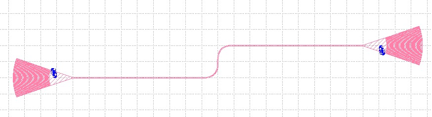

# colab-layout

Repositório de cooperação do time para organizar vários circuitos em um único layout de fabricação na [nanoTOOLS](https://www.appliednt.com/nanosoi/sys/) (Applied Nanotools, processo NanoSOI).

O **layout principal** da corrida está em [`circuito-lucivaldo-v1`](circuito-lucivaldo-v1).

## Prazos desta corrida (Silicon MPW)

Datas da corrida de **novembro de 2026**. Os designs devem ser submetidos até a data final, no horário indicado, para entrar no run.

| Etapa | Data | Horário |
| --- | --- | --- |
| Último dia para solicitar FaML ou janelas through-cladding (Layer 6) | terça-feira, 3 de novembro de 2026 | 18:00 MST |
| Último dia para revisão opcional de layout (draft) | terça-feira, 10 de novembro de 2026 | 18:00 MST |
| Submissão final (layouts DRC-clean) | terça-feira, 24 de novembro de 2026 | 18:00 MST |

Pedidos de customização extra (FaML, Layer 6 etc.) devem ser feitos **duas semanas** antes do prazo final de DRC, conforme as regras da foundry.

## Procedimento geral

1. Cada pessoa faz um **fork** deste repositório.
2. Sobe o próprio layout em uma **pasta separada**.
3. Passa o circuito pelo **DRC da nanoTOOLS**.
4. Depois de validar, inclui o circuito no **layout principal** de Lucivaldo (`circuito-lucivaldo-v1`).

## PDK

A versão atual do PDK é a **Version 8.0**. O arquivo está com José Roberto.

Quem ainda não tiver o PDK pode solicitar por e-mail: [jose.arcanjo@ee.ufcg.edu.br](mailto:jose.arcanjo@ee.ufcg.edu.br).

## Regras gerais de layout

- As **grades de entrada e saída** devem estar direcionadas para **lados opostos**:

  

- **Sugestão adicional:** as grades devem estar **desalinhadas em x** (não ficar na mesma coordenada horizontal).

## Compilar o layout principal

Na pasta do circuito:

```powershell
cd circuito-lucivaldo-v1
uv sync
uv run python compile.py
```

GDS gerado: `CircuitoLucivaldoV1.gds` no mesmo diretório.
